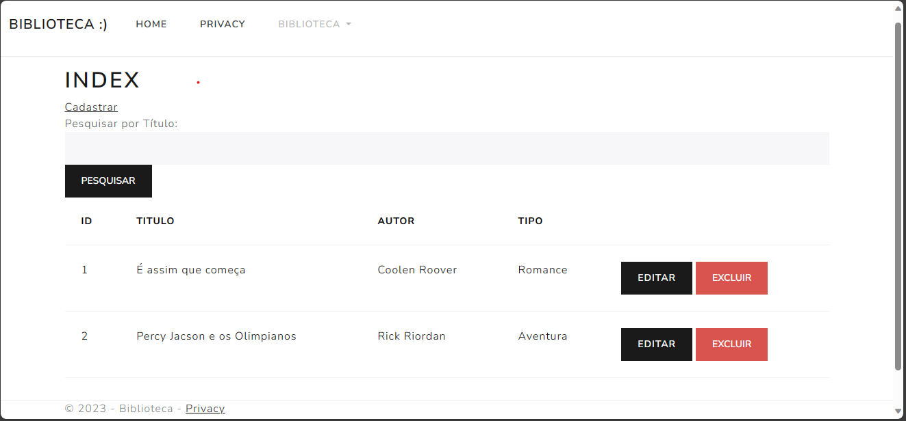

##  Integrantes

Daniel Santos RM 94265
Tarcisio Couto RM 94717
Felipe Jardim RM 88383

<h1 align="center"> Biblioteca-.NET </h1>

 Biblioteca com CURD + algumas funcionalidades em .NET MVC 

  

## 🚀 Tecnologias

Esse projeto foi desenvolvido com as seguintes tecnologias:

- C#, .NET e
- Bootstrap 
- Git e Github

## 💻 Projeto
O Projeto é um CRUD de uma Biblioteca para praticar os conhecimentos adquiridos na aula

